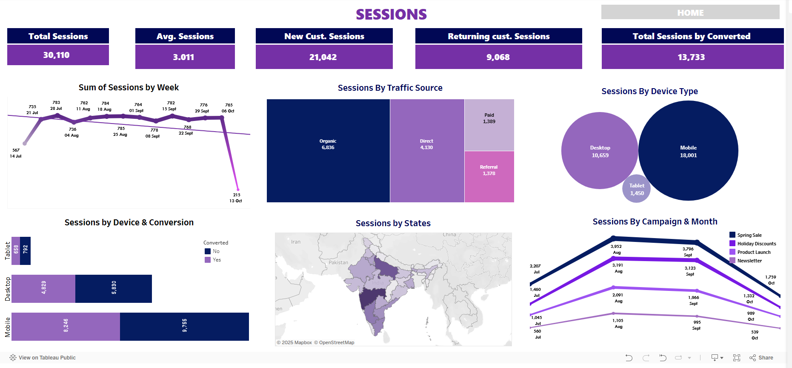

# customer-journey-analytics-dashboard
An interactive Tableau dashboard to analyze Swiggy’s web traffic and user behavior, uncovering insights on bounce rate, conversion, and engagement across devices, campaigns, and traffic sources.

**Live Dashboard:**  
[View on Tableau Public](https://public.tableau.com/app/profile/guddu.singh8325/viz/SwiggyTrafficVisitorsBehaviourInsightsNextleapMilestoneProject/HOME)

This project analyzes Swiggy’s web traffic and user journey to uncover insights into bounce rate, conversion performance, traffic sources, and user engagement. Built using Tableau and Excel, the dashboard supports data-driven marketing and UX decisions.

## Project Type
Web Traffic Analysis / Customer Journey Analytics

## Tools Used
- Tableau (for interactive dashboarding)
- Excel (for data cleaning and structuring)

## Objective
To help Swiggy’s marketing and product teams understand the customer journey — from landing to conversion — by visualizing key performance metrics and identifying behavior patterns across devices, channels, and campaigns.

## Key Metrics Tracked
- Total Sessions
- Bounce Rate
- Conversion Rate
- Avg. Session Duration
- Traffic Source (Organic, Paid, Direct, Referral)
- Device Type (Mobile vs Desktop)
- Page Views
- Geographic and Campaign Performance

## Outcome
The dashboard enables teams to:
- Identify high-bounce or low-conversion segments
- Understand which traffic sources and devices drive engagement
- Support strategic marketing decisions with visual insights

---

## Dashboard Snapshots

### 1. Home Overview

### 2. Session Insights

### 3. Bounce Rate Analysis

### 4. Conversion Funnel

### 5. Page View Breakdown

