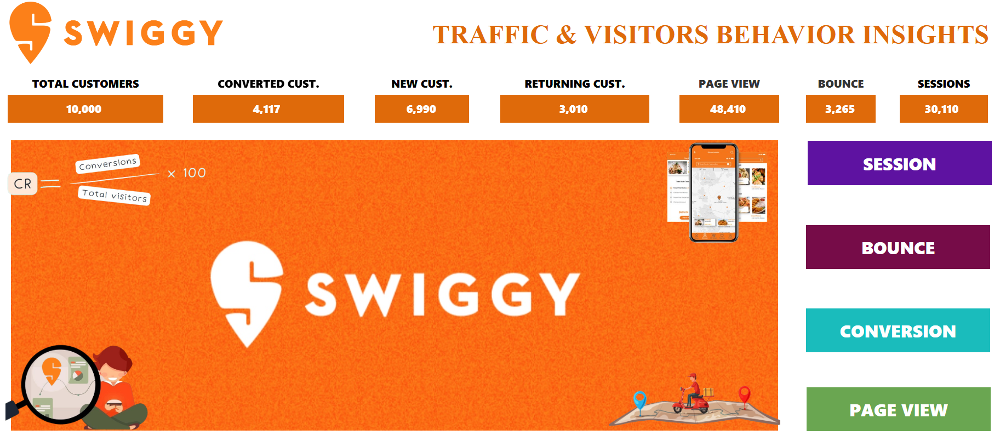
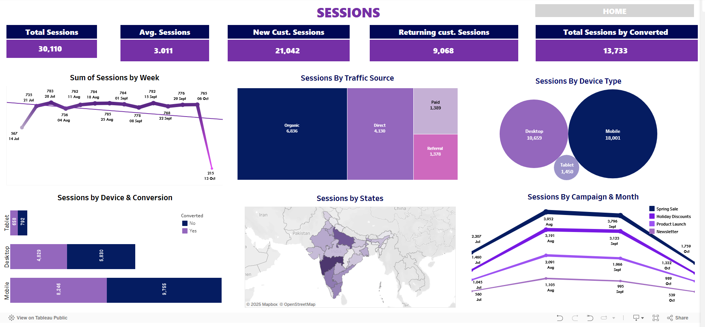
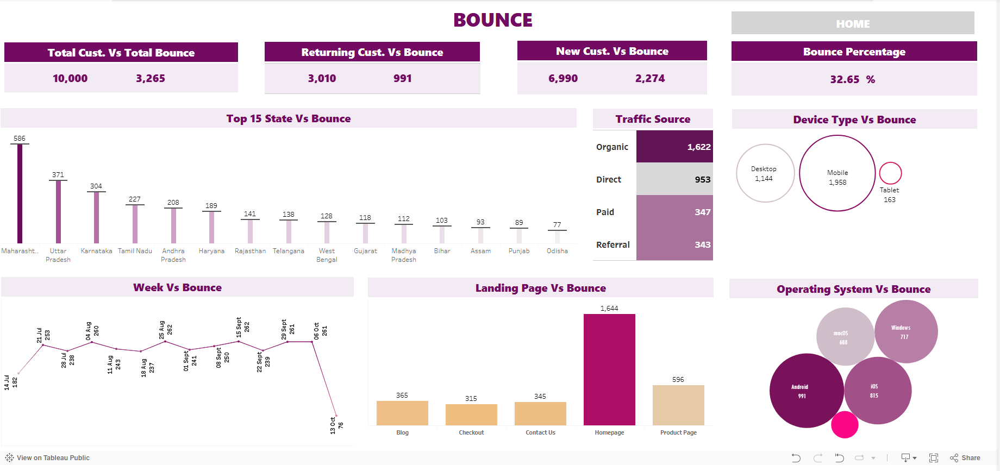
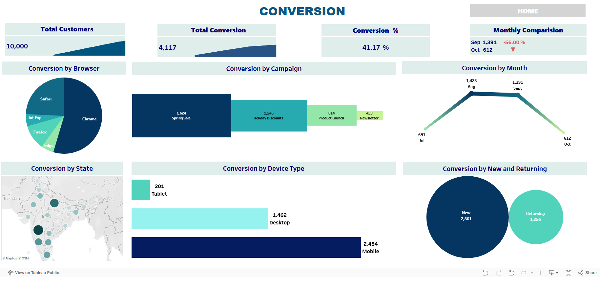
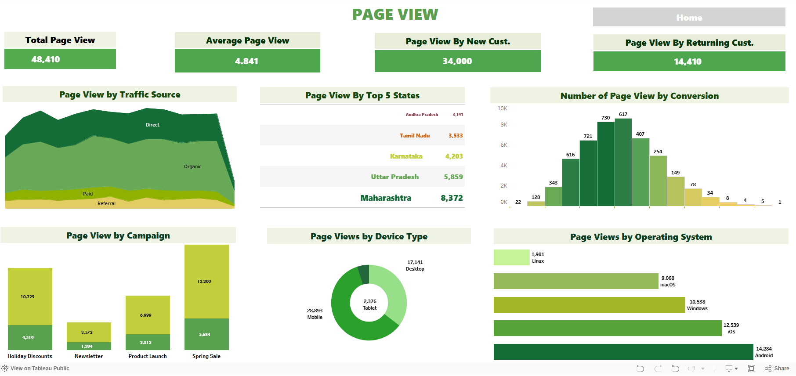

# Customer Journey Analytics Dashboard

**Live Dashboard:**  
[View on Tableau Public](https://public.tableau.com/app/profile/guddu.singh8325/viz/SwiggyTrafficVisitorsBehaviourInsightsNextleapMilestoneProject/HOME)

This project analyzes Swiggy’s web traffic and user journey to uncover insights into bounce rate, conversion performance, traffic sources, and user engagement. Built using Tableau and Excel, the dashboard supports data-driven marketing and UX decisions.

---

## Dashboard Snapshots

### 1. Home Overview

### 2. Session Insights

### 3. Bounce Rate Analysis

### 4. Conversion Funnel

### 5. Page View Breakdown

